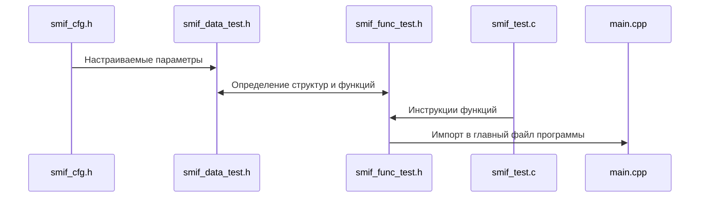

<h1>Библиотека для управления поворотным механизмом платформы</h1>

<h3>Оглавление</h3>

<ul>
    <title>
        Оглавление
    </title>
    <li>
        <p>
            <a href="#s1" style="color: rgb(35,162,145">
                Способ применения
            </a>
        </p>
    </li>
    <li>
        <p>
            <a href="#s_2" style="color: rgb(35,162,145">
                Типы данных
            </a>
        </p>
    </li>
    <li>
        <p>
            <a href="#_3" style="color: rgb(35,162,145)">
                Функции низкого уровня
            </a>
        </p>
    </li>
    <li>
        <p>
            <a href="#s_4" style="color: rgb(35,162,145">
                Функции высокого уровня
            </a>
        </p>
    </li>
    <li>
        <p>
            <a href="#s_5" style="color: rgb(35,162,145">
                Настраиваемые параметры
            </a>
        </p>
    </li>
    <li>
        <p>
            <a href="#s_6" style="color: rgb(35,162,145">
                Организации файлов библиотеки
            </a>
        </p>
    </li>
</ul>

<hr>

<h2 id="s_1" style="color: rgb(35, 162, 145)">
    <center>Способ применения</center>
</h2>

Для использования неоходимо использовать один из следующих редакторов кода <code>Visual Studio</code>, <code>Visual Studio Code</code>, <code>CLion</code>. В редакторе кода необходимо установить расширение PlatformIO и открыть папку с "проекта". При установленном расширении прочитается конфигурацонный файл сборки проекта platformio.ini и откроется доступ к инструментам, которые позволяют выполнять сборку, загрузку и монитор порта.

<h2 id="s_2" style="color: rgb(35, 162, 145)">
    <center>Типы данных</center>
</h2>

Методы запитывания обмоток ДПТ или же последовательность в виде битовой карты активации транзисторов H-моста.

``` C
/**
 * \brief Перечисление методов подачи питания на ДПТ 
 */
typedef enum
{
    DRIVER_PWR_NO_POWER, // Нет питания двигателя
    DRIVER_PWR_L_POWER,  // Питание left
    DRIVER_PWR_R_POWER,  // Питание right
    DRIVER_PWR_ALL_POWER // Питание right и left
} DRIVER_PWR_ST;
```

Структура, содержащая номера МК, используемые для контроллера вращения ДПТ в составе поворотного механизма платформы SMIF. 

``` C
/**
 * \brief Структура с номерами I/O МК для драйвера двигателя
 * \param l_pwm Номер PWM I/O МК для right 
 * \param r_pwm Номер PWM I/O МК для left
 * \param l_en Номер Digital I/O МК для right
 * \param r_en Номер Digital I/O МК для left
 * \param l_is Номер Analog I/O МК для right
 * \param r_is Номер Analog I/O МК для left
 */
typedef struct
{
    uint8_t l_pwm;  // Пин МК для L_PWM
    uint8_t r_pwm;  // Пин МК для R_PWM
    uint8_t l_en;   // Пин МК для L_EN
    uint8_t r_en;   // Пин МК для R_EN
    uint8_t l_is;   // Пин МК для L_IS
    uint8_t r_is;   // Пин МК для R_IS
} driver_pins;
```

Структура с парметрами управления контроллером вращения ДПТ.

``` C
/**
 * \brief Структура с параметрами контроллера вращения ДПТ
 * \param l_pwm ШИМ для скорости вращения
 * \param r_pwm ШИМ для скорости вращения
 * \param l_is Ток при вращении left
 * \param r_is Ток при вращении right
 * \param en Доступ питания к обмоткам двигателя
 */
typedef struct
{
    uint8_t l_pwm;    // ШИМ для скорости вращения left
    uint8_t r_pwm;    // ШИМ для скорости вращения right
    float l_is;       // Ток при вращении left
    float r_is;       // Ток при вращении right
    DRIVER_PWR_ST en; // Доступ питания к обмоткам двигателя
} motor_driver_param;
```

Структура с функциями низкого уровня, используются для правильной подачи ШИМ-сигнала контроллеру вращения ДПТ. 

``` C
/**
 * \brief Структура функций управления контроллером вращения ДПТ
 * \param move(...) Функция выполнения вращения
 * \param stop(...) Функция выполнения остановки вращения
 */
typedef struct
{
    // Функция выполнения вращения
    void (*move)(const driver_pins*, motor_driver_param*);
    // Функция выполнения остановки вращения
    void (*stop)(const driver_pins*, motor_driver_param*);
} motor_driver_func;
```

Структура данных верхнего уровня управления подвижным механизмом платформы SMIF.

``` C
/**
 * \brief Структура параметров управления двигателем
 * \param driver_pins Структура номеров I/O МК для драйвера двигателя
 * \param driver Структура параметров управления драйвером двигателя
 * \param motor_func Структура функций управления драйвером двигателя
 */
typedef struct
{
    driver_pins* driver_pin;
    motor_driver_param* driver;
    motor_driver_func* motor_func;
} motorDrivers_param;
```

Структура с функциями высокого уровня, используются для правильной подачи ШИМ-сигнала контроллеру вращения ДПТ.

``` C
/**
 * \brief Структура функций управления двигателем в составе поворотного 
 * механизма
 * \param init(...) Функция инициализции данных и настройки I/O
 * \param stop(...) Функция задания остановки вращения
 * \param forward(...) Функция задания запуска вращения по часовой
 * \param backward(...) Функция задания запуска вращения против часовой
 */
typedef struct
{
    // Функция инициализции данных и настройки I/O
    void (*init)(motorDrivers_param*, motor_driver_func*);
    // Функция остановки вращения
    void (*stop)(motorDrivers_param*);
    // Функция запуска вращения по часовой
    void (*forward)(motorDrivers_param*);
    // Функция запуска вращения против часовой
    void (*backward)(motorDrivers_param*);
} motorDrivers_func;
```

<h2 id="s_3" style="color: rgb(35, 162, 145)">
    <center>Функции низкого уровня</center>
</h2>

Функция низкого уровня для выполнения вращения вала двигателя (ДПТ).

``` C
/**
 * \brief Функция запуска вращения двигателя
 * \param [in] bts7960_pins Структура данных о подключении к МК
 * \param [out] bts7960_data Структура данных о управлении драйвером двигателя
 * \return None
 */
void motorMove(const driver_pins *bts7960_pins,
               motor_driver_param *bts7960_data);
```

Функция низкого уровня для остановки вращения вала двигателя (ДПТ).

``` C
/**
 * \brief Функция остановки вращения двигателя
 * \param [in] bts7960_pins Структура данных о подключении к МК
 * \param [out] bts7960_data Структура данных о управлении драйвером двигателя
 * \return None
 */
void motorStop( const driver_pins *bts7960_pins,
                motor_driver_param *bts7960_data);
```

<h2 id="s_4" style="color: rgb(35, 162, 145)">
    <center>Функции высокого уровня</center>
</h2>

Функция верхнего уровня для инициализации данных для управления

``` C
/**
 * \brief Выполнение инициализции данных и настройки I/O
 * \param moveData Структура параметров управления двигателем
 * \param moveFunc Структура функций управления двигателем в составе поворотного 
 * механизма
 * \return None
 */
void driversInit(   motorDrivers_param *moveData,
                    motor_driver_func *moveFunc);
```

Функция верхнего уровня для задания об остановке вращения ДПТ в составе поворотного механизма платформы SMIF. 

``` C
/**
 * \brief Выполнение задания остановки вращения
 * \param moveData Структура параметров управления двигателем
 * \return None
 */
void driversStop(motorDrivers_param *moveData);
```

Функция верхнего уровня для задания вращения по часовой ДПТ в составе поворотного механизма платформы SMIF.

``` C
/**
 * \brief Выполнение задания запуска вращения по часовой
 * \param moveData Структура параметров управления двигателем
 * \return None
 */
void driversForward(motorDrivers_param *moveData);
```

Функция верхнего уровня для задания вращения против часовой ДПТ в составе поворотного механизма платформы SMIF.

``` C
/**
 * \brief Выполнение задания запуска вращения против часовой
 * \param moveData Структура параметров управления двигателем
 * \return None
 */
void driversBackward(motorDrivers_param *moveData);
```

<h2 id="s_5" style="color: rgb(35, 162, 145)">
    <center>Настраиваемые параметры</center>
</h2>

Макросы для задания I/O, которые отвечают за упралением скоростью вращения.

``` C
/*
    Макросы для указания I/O МК под управления котроллером
 вращения ДПТ (BTS7960)
*/

#define PIN_R_PWM 9     // Сигнал PWM для вращения по часовой
#define PIN_L_PWM 10    // Сигнал PWM для вращения против часовой
#define PIN_R_EN 0      // Сигнал EN для вращения по часовой
#define PIN_L_EN 0      // Сигнал EN для вращения против часовой
#define PIN_R_IS 0      // Сигнал IS при вращении по часовой
#define PIN_L_IS 0      // Сигнал IS при вращении против часовой
```

<h3>Параметры, связанные непосредственно с платформой SMIF</h3>

Макрос для установки "скорости" вращения ДПТ с сипользованием контроллера вращения (H-Bridge).

``` C
#define SMIF_MAX_PWM_DRIVER     (uint8_t)(63) // Max скороть (PWM) в пределах [0;255]
```

Макросы для задания I/O, которые отвечают за обратную связь (считывание логических сигналов с концевиков).

``` C
#define SMIF_SWITCH_CASE_OPEN   (uint8_t)(4)  // Сигнал концевика SMIF OPEN CASE
#define SMIF_SWITCH_CASE_CLOSE  (uint8_t)(5)  // Сигнал концевика SMIF CLOSE CASE
#define SMIF_SWITCH_CASE_DETECT (uint8_t)(6)  // Сигнал концевика SMIF DETECT CASE
```

Переменные с асинхронным доступом со статичесчим местом в памяти МК, которые хранят состояние концевиков.

``` C
// Состояние концевика SMIF OPEN CASE
static volatile int caseOpenSt = 0;
// Состояние концевика SMIF CLOSE CASE
static volatile int caseCloseSt = 0;
// Состояние концевика SMIF DETECT CASE
static volatile int caseDetectSt = 0;
```

<h2 id="s_6" style="color: rgb(35, 162, 145)">
    <center>Организации файлов библиотеки</center>
</h2>


Ниже представлена смеха взаимодействия файлов библиотеки при сборке программы.
<table border="0">
<col width="2000" height="400">
    <tr>
        <th align="center">



</th>
    </tr>
    <tr>
        <th>
            <b><p style="text-align: center; font-size: 10pt">
                Рис. 1. Смеха взаимодействия файлов библиотеки
            </p></b>
        </th>
    </tr>
</table>